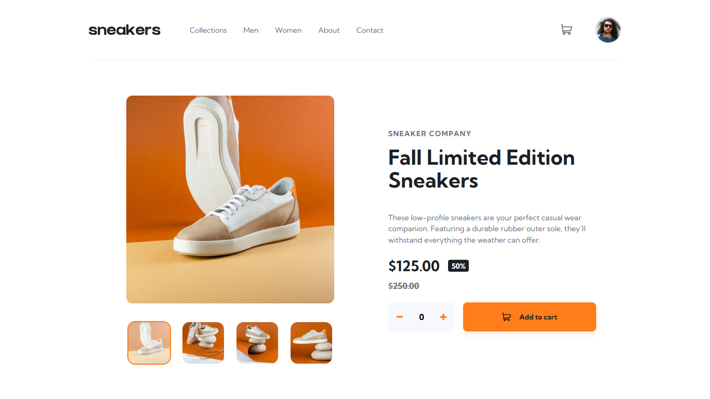
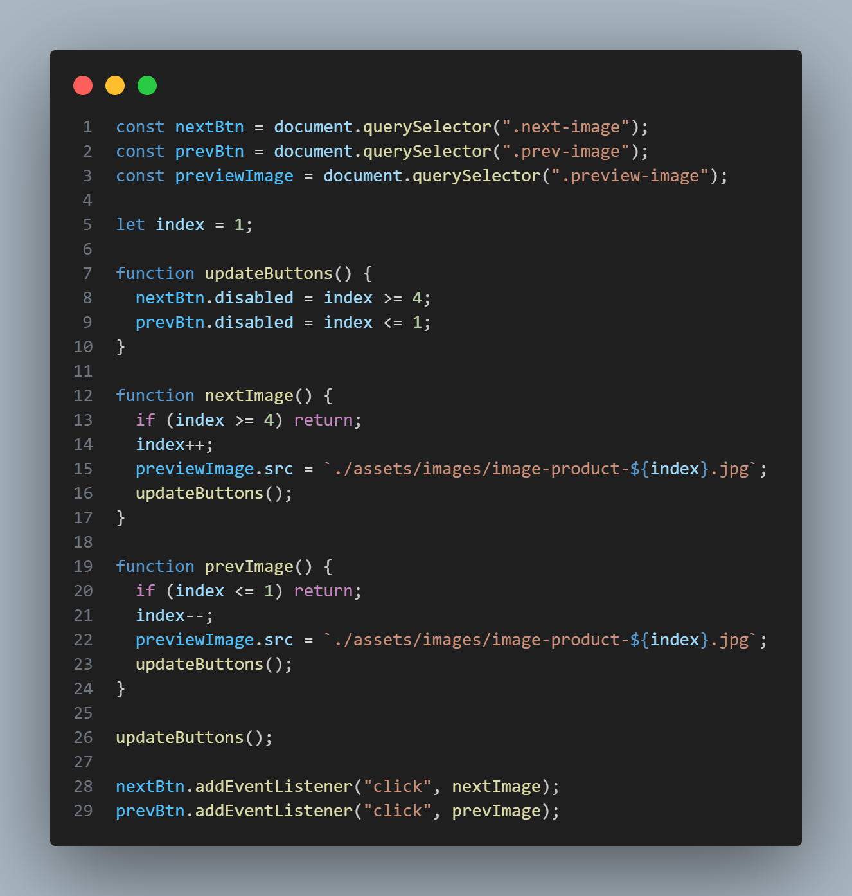
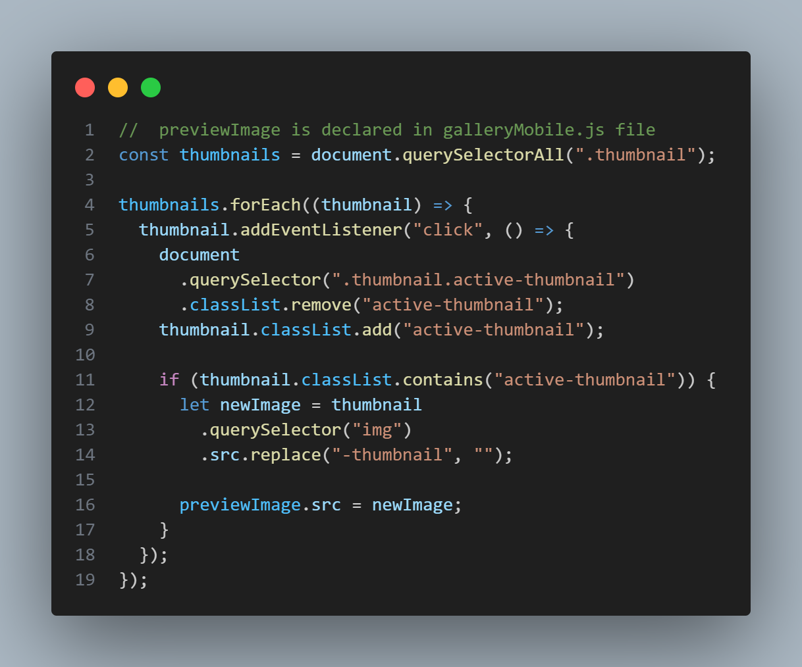

# Frontend Mentor - E-Commerce Product Page (Solution)



### Challenge Description
This is a solution to the [E-Commerce Product Page (Challenge) - Frontend Mentor](https://www.frontendmentor.io/challenges/ecommerce-product-page-UPsZ9MJp6). Frontend Mentor challenges help you improve your coding skills by building realistic projects.

 Users should be able to
- View the optimal layout for the site depending on their device's screen size
- See hover states for all interactive elements on the page
- Open a lightbox gallery by clicking on the large product image
- Switch the large product image by clicking on the small thumbnail images
- Add items to the cart
- View the cart and remove items from it

### Highlight Screenshots
Here are some parts of the code I'm really proud of




### My Process
- Mobile-first workflow
- Semantic HTML5 markup
- CSS custom properties
- JavaScript
- Flexbox

### What I Learned
During this project, I finally got to use most of my CSS and JavaScript skills. It made me realize how much better I’ve gotten at problem-solving on my own - from using the `:not()` selector and nesting in CSS to getting creative with template strings.

```css
 &:hover :not(.active-thumbnail) {
        opacity: 0.5;
      }
```

```js
lightboxNext.addEventListener("click", () => {
  if (index < lightboxThumbnails.length) {
    index++;
    setPreviewImage(`./assets/images/image-product-${index}.jpg`);
  }
});
```

### Continued Development
In the future, I plan to rebuild that website using more advanced and modern frameworks like **React**.